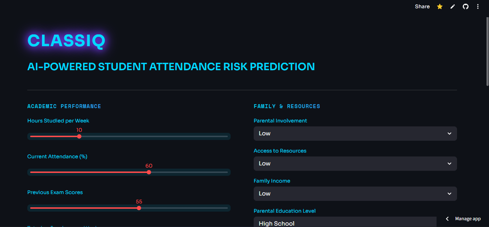
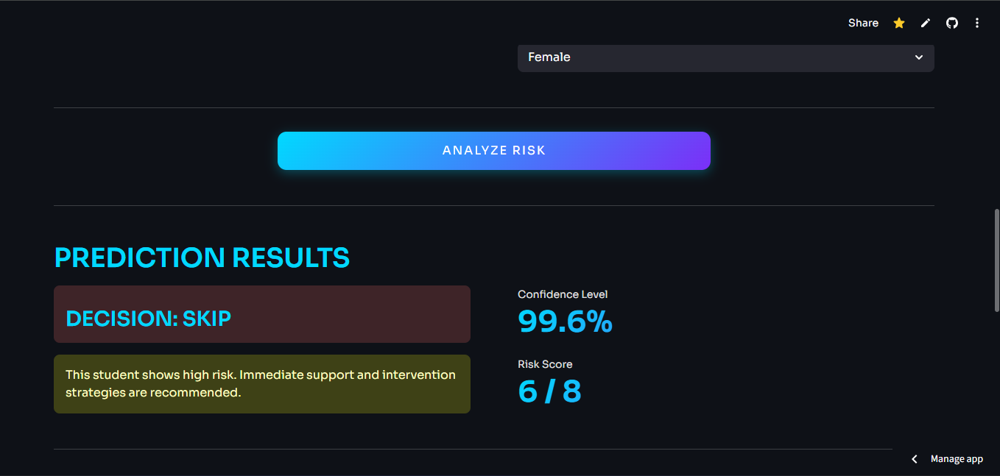

## ClassIQ

ClassIQ is an AI-powered student attendance risk prediction system built with machine learning and deployed using Streamlit.

It analyzes academic, behavioral, and environmental factors to predict whether a student is likely to attend or skip class—helping drive smarter, data-informed decisions.

---

## 📸 Preview

*Student risk assessment dashboard with real-time predictions*

*Detailed factor analysis and attendance insights*

---

## Live App

👉 https://classiq.streamlit.app/

---